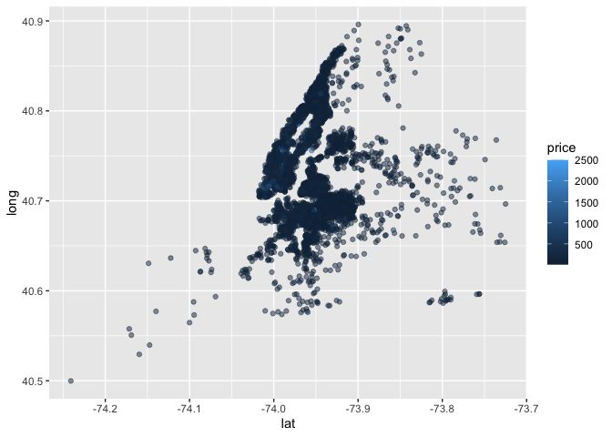

case-study
================
Yang Gao
10/14/2021

``` r
library(tidyverse)
```

    ## ── Attaching packages ─────────────────────────────────────── tidyverse 1.3.1 ──

    ## ✓ ggplot2 3.3.5     ✓ purrr   0.3.4
    ## ✓ tibble  3.1.4     ✓ dplyr   1.0.7
    ## ✓ tidyr   1.1.3     ✓ stringr 1.4.0
    ## ✓ readr   2.0.1     ✓ forcats 0.5.1

    ## ── Conflicts ────────────────────────────────────────── tidyverse_conflicts() ──
    ## x dplyr::filter() masks stats::filter()
    ## x dplyr::lag()    masks stats::lag()

``` r
library(p8105.datasets)
library(leaflet)
```

## load a dataset

``` r
data(nyc_airbnb)
```

questions wanna ask *How many rentals are there? Of what type? In what
places? *Is price correlated with review score? *Which neighbarhood is
most popular? Most expensive? *Is availability related to price? *Is
room type related to neighbarhood? *Is length of stay related to
neighborhaood group?

``` r
nyc_airbnb = 
  nyc_airbnb %>% 
  mutate(stars = review_scores_location/2) %>% 
  rename(borough = neighbourhood_group)
```

``` r
nyc_airbnb %>% 
  ggplot (aes(x=minimum_nights, y=price, color = borough)) +geom_point()
```

<!-- -->

``` r
nyc_airbnb %>% 
  ggplot (aes(y=price, x=availability_365, color = borough)) +geom_point() +
  facet_grid(.~ borough)
```

<!-- -->

count

``` r
nyc_airbnb %>% 
 janitor :: tabyl (borough, room_type)
```

    ##        borough Entire home/apt Private room Shared room
    ##          Bronx             192          429          28
    ##       Brooklyn            7427         9000         383
    ##      Manhattan           10814         7812         586
    ##         Queens            1388         2241         192
    ##  Staten Island             116          144           1

``` r
nyc_airbnb %>% 
  count (borough, room_type) %>% 
  pivot_wider()
```

    ## # A tibble: 15 × 3
    ##    borough       room_type           n
    ##    <chr>         <chr>           <int>
    ##  1 Bronx         Entire home/apt   192
    ##  2 Bronx         Private room      429
    ##  3 Bronx         Shared room        28
    ##  4 Brooklyn      Entire home/apt  7427
    ##  5 Brooklyn      Private room     9000
    ##  6 Brooklyn      Shared room       383
    ##  7 Manhattan     Entire home/apt 10814
    ##  8 Manhattan     Private room     7812
    ##  9 Manhattan     Shared room       586
    ## 10 Queens        Entire home/apt  1388
    ## 11 Queens        Private room     2241
    ## 12 Queens        Shared room       192
    ## 13 Staten Island Entire home/apt   116
    ## 14 Staten Island Private room      144
    ## 15 Staten Island Shared room         1

``` r
nyc_airbnb %>% 
  ggplot (aes(x=stars, y =price))+ geom_point()
```

    ## Warning: Removed 10037 rows containing missing values (geom_point).

<!-- -->

``` r
nyc_airbnb %>% 
  group_by (neighbourhood) %>% 
  summarize (mean_price = mean(price, na.rm = TRUE)) %>% 
  arrange(mean_price)
```

    ## # A tibble: 217 × 2
    ##    neighbourhood     mean_price
    ##    <chr>                  <dbl>
    ##  1 Little Neck             41.7
    ##  2 Schuylerville           42.6
    ##  3 Morris Heights          47.6
    ##  4 Mount Eden              49.3
    ##  5 Soundview               50.6
    ##  6 Claremont Village       51.6
    ##  7 Hunts Point             52.2
    ##  8 Baychester              54  
    ##  9 Rosebank                55  
    ## 10 Belmont                 55.4
    ## # … with 207 more rows

``` r
nyc_airbnb %>% 
  filter (borough == "Manhattan", price <= 1000 )%>% 
  mutate (neighbourhood = fct_reorder(neighbourhood, price)) %>% 
  ggplot (aes (x= neighbourhood, y=price)) +geom_boxplot() +coord_flip() +facet_grid(.~ room_type)
```

<!-- -->

Price vs Location

``` r
nyc_airbnb %>% 
  sample_n (5000) %>% 
  ggplot (aes(x=lat , y=long, color = price)) +geom_point(alpha=0.5)
```

<!-- -->

## mapping

``` r
#github document cannot knit maps (eval=False)
#html document can knit map 
pal= colorNumeric ("Viridis", NULL)
nyc_airbnb %>% 
  sample_n(1000) %>% 
  leaflet() %>% 
  addTiles() %>% 
addCircleMarkers(~lat, ~long, radius = 1, color=~pal(price))
```
